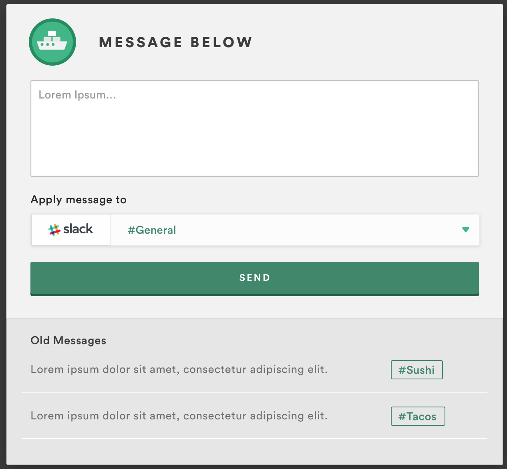

# janus
## Haven Full-Stack Engineering Applicant Exercise
> In ancient Roman religion and myth, Janus (/ˈdʒeɪnəs/; Latin: Ianus, pronounced [ˈjaː.nus]) is the god of beginnings and transitions, and thereby of gates, doors, doorways, passages and endings. He is usually depicted as having two faces, since he looks to the future and to the past.

## The Mini Project
Create a small application or API that will communicate with a Slack channel. **You can use this skeleton project as a starting point, or use another framework of your choice. The only requirement is it must be Javascript based, and demonstrate communication with the Slack API.**

> Do not hesitate to ask questions about how this could/should be set up! This is not a strict quiz, it is a starting point for collaboration.

#### Skeleton Overview
The skeleton provided here is a barebones [Strongloop/Loopback](https://docs.strongloop.com/display/public/LB/Getting+started+with+LoopBack) application. The additions include

- The `Person/People` model, which extends the built-in `User` model, and allows the use of all the built-in methods that ship with the Loopback `User` model. You are not required to use the `Person` model, but please think of API security and use Slack payload tokens to secure the receiving end.
- The `Slack` model. This is where your custom code will live, and where you'll add the libraries of your choosing to communicate with Slack.
- Scaffolded Angular UI with a dummy example of how to call remote methods / API endpoints - feel free to use any other UI library/framework (React, Ember, etc)

### Option 1
Create an API that responds to a specific Slack channel when a specific trigger word is used in a message. Heads up: this option requires SSL communication from Slack to an internet-accessible endpoint.

### Option 2
Create a small form with fields for **channel** and **message** (or use the API Explorer with these as a payload). When this form is submitted, it posts a message to the specified channel using a custom API endpoint on the Slack model (see below).  Please style the form to look like the following mockup:

The images for this mockup are stored in the client/images/ folder.

## Getting Started
- The [Create a Simple API](https://docs.strongloop.com/display/public/LB/Create+a+simple+API) tutorial for Strongloop is a great starting point, along with [Installing Strongloop](https://docs.strongloop.com/display/public/LB/Installing+StrongLoop) and [Loopback Core Concepts](https://docs.strongloop.com/display/public/LB/LoopBack+core+concepts).
- Set up a [Slack](https://slack.com) account and familiarize yourself with the [Integration Documentation](https://slack.com/integrations), most notably the Outgoing/Incoming Webhooks and Bots to get information out of Slack and to your API. Hint: look for Slack npm libraries to jump start development.
- Install [NodeJS](https://nodejs.org) on your dev machine, and make sure [npm](https://www.npmjs.com/) is also installed (it should come with most distributions of node).
- Clone this repository.
- Once cloned, install the application dependencies using `npm install` in the root of the project.
- Once installed, start the application with `slc run` or `npm start`.
- Extend the stubbed remote methods inside [common/models/slack.js](https://github.com/HavenInc/janus/blob/master/common/models/slack.js) to communicate with Slack using your choice of integration.
- Use the [API Explorer http://0.0.0.0:3000/explorer](http://0.0.0.0:3000/explorer) to test your new methods while in development. This can also be used to show complete operation of your code.
- Document tradeoffs/shortcuts in the interest of time; this exercise should not take more than 2-3 hours for basic functionality.

## Bonus Options
- Add a login form so that the message form (in option 2) is only accessible from behind authentication. Do not use cookies.
- Use Slack's message buttons to provide easy ways for recipients to respond to messages (requires an OAuth app to be registered)
- Create an npm run script inside package.json that uses supervisor to reload/rerun the code as you edit it.
- Convert the Slack model to extend PersistedModel and store all outgoing/incoming messages in a database (SQL, NoSQL, ?).
- What would be an interesting way to present the app to the engineering team?
